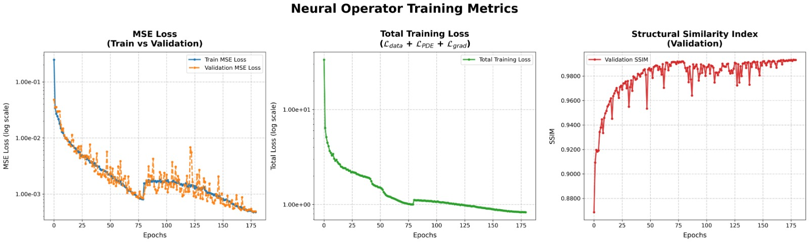
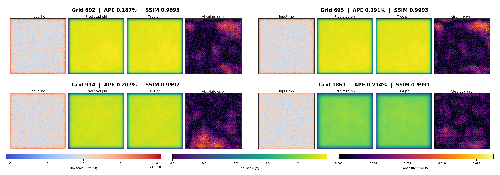

# ⚡ Physics-Informed Neural Operator-Based Poisson Solver

<div align="center">

**DeepONet + Fourier Neural Operator for 2-D Electrostatic PIC Simulations**

*Learning the Poisson operator ρ → ϕ for repeated electrostatic PIC field solves*

[](https://python.org)
[](https://pytorch.org)
[](LICENSE)

| Metric | Value |
|--------|-------|
| 📉 Average RMSE | `4.2178 × 10⁻² V` |
| 📊 Average APE | `3.5599%` |
| 📈 Median APE | `1.5001%` |
| 🔁 PIC Iterations Validated | `2000` |
| 🧪 Held-out Test Fields | `4002` |

</div>

---

## 📌 Table of Contents

- [Motivation](#-motivation)
- [Problem Statement](#-problem-statement)
- [Why Not Classical or Standard Neural Solvers?](#-why-not-classical-or-standard-neural-solvers)
- [Approach: Operator Learning](#-approach-operator-learning)
- [Architecture](#architecture)
- [Dataset](#-dataset)
- [Training](#-training)
- [Inference Pipeline](#-inference-pipeline)
- [Results](#-results)
- [Key Contributions](#-key-contributions)
- [Authors](#authors)

---

## 🚀 Motivation

In an **electrostatic Particle-in-Cell (PIC) simulation**, particle motion and electric fields are tightly coupled. At every time-step, the simulation follows this loop:

```
Move particles  →  Deposit charge ρ  →  Solve Poisson  →  Interpolate field E  →  (repeat)
```

> 🔴 **The Poisson field solve is repeated at every time-step and can consume more than 30% of the total simulation time.**

Reducing this cost directly improves the feasibility of longer and more complex plasma simulations.

---

## 📐 Problem Statement

The field solve converts a grid-based charge density into an electrostatic potential under grounded wall boundaries.

### 2-D Electrostatic Poisson Equation

$$\nabla^2 \phi(x, y) = -\frac{\rho(x, y)}{\epsilon_0}$$

| | Description |
|---|---|
| **Input** | Charge density `ρ(x, y)` on a `256 × 256` mesh (supplied by PIC code) |
| **Boundary Condition** | Grounded Dirichlet: `ϕ = 0` on `∂Ω` |
| **Output** | Electrostatic potential `ϕ(x, y)` over the same grid |
| **Downstream Use** | Electric field recovery via `E = −∇ϕ` for particle pushing |

---

## ❌ Why Not Classical or Standard Neural Solvers?

### Classical Solvers
- **LU / Pardiso** gives reliable reference potentials, but the factorized sparse system becomes expensive as mesh size grows.
- **Iterative methods** (e.g., Conjugate Gradient) reduce cost in some regimes but still require repeated iterations with input-dependent runtime.

> ✅ The Poisson operator and boundary conditions stay **fixed** throughout the simulation — only `ρ` changes. This makes the problem ideal for **amortized operator learning**.

### Standard Neural Surrogates

| Approach | Limitation |
|---|---|
| **CNN** | Local filters don't capture the global coupling inherent in electrostatics; tied to training discretization |
| **Standard PINN** | Learns one solution for one source term; retraining for every new charge map in PIC is not practical |

> 💡 **Key Insight:** The repeated PIC use case needs a learned *operator*, not a single learned solution.

---

## 🧠 Approach: Operator Learning

Instead of learning one potential field, the model learns the **rule** that maps *any* admissible charge field to its corresponding potential field.

```
ρ(x, y)  ──→  G (Poisson Operator)  ──→  ϕ(x, y)
 Charge field                           Potential field
```

**Goal:** Learn `G : ρ ↦ ϕ` from many charge-potential pairs.

**Model Choice:**
- **DeepONet** provides the branch–trunk operator-learning structure.
- **Fourier Neural Operator (FNO)** branch captures non-local electrostatic coupling efficiently in the frequency domain.

---

<a name="architecture"></a>

## 🏗️ Architecture

### High-Level View

```
ρ̃(x, y)  ──→  [ FNO Branch: bₖ ]  ──┐
                                       ├──→  Fusion: Σ bₖtₖ  ──→  ϕ̂(x, y)
(x, y)   ──→  [ Trunk MLP: tₖ  ]  ──┘
```

$$\hat{\tilde{\phi}}(x, y; \rho) = \sum_{k=1}^{4} b_k(\rho; x, y) \cdot t_k(x, y)$$

---

### 🔵 FNO Branch — Why Fourier Space?

The Poisson equation is **non-local**: potential at one point depends on charge throughout the entire domain. A Fourier layer sees the full field through its frequency representation, so global coupling is built into the branch network.

**One FNO Spectral Operation:**

$$(\mathcal{K}u)(x) = \mathcal{F}^{-1}\left(R_\phi \cdot (\mathcal{F}u)\right)(x)$$

Each FNO layer combines:
- A **spectral path** (FFT → learned weights → iFFT) for smooth long-range structure
- A **pointwise skip projection** `Wv⁽ˡ⁾` to preserve local channel information

**What is learned:** Complex weights `Rϕ` mix retained spectral modes; a finite low-frequency mode budget focuses the model on the dominant smooth electrostatic structure.

---

### 🟠 Coordinate Trunk

- Receives **continuous** spatial coordinates `(x, y) ∈ [0, 1]²`
- Produces location-dependent weights `tₖ(x, y)` using a compact MLP
- Enables the operator to be evaluated at any spatial coordinate, not just pixel indices

---

### 🟣 Multi-Basis Fusion

$$\hat{\tilde{\phi}} = b_1 t_1 + b_2 t_2 + b_3 t_3 + b_4 t_4$$

Each product combines charge-dependent information (branch) with geometry-dependent weights (trunk) for a compact reconstruction of the normalized potential.

---

### 🔒 Hard Boundary Enforcement

Grounded walls are a physical constraint enforced **exactly** via post-processing:

$$\hat{\phi}_{\text{corrected}} = \hat{\phi}_{\text{pred}} - \delta^{(n)}, \quad \delta^{(n)} = \text{avg}\left(\hat{\phi}_{\text{pred}}\big|_{\partial\Omega}\right)$$
$$\hat{\phi}_{\text{final}}(\mathbf{x}_{\partial\Omega}) = 0$$

- **Gauge correction:** subtracting the mean predicted boundary value selects the grounded Dirichlet gauge without altering the interior electric field.
- **PIC stability:** hard clamping eliminates residual boundary gradients that could cause spurious particle acceleration.

---

### 📐 Mesh Invariance

The architecture is designed as an approximation of the continuous operator `G : ρ ↦ ϕ`:
- The **FNO branch** stores fixed spectral weights; FFT/iFFT can be evaluated on different grid sizes.
- The **coordinate trunk** receives real-valued coordinates, so the same MLP can be queried on finer grids.

---

## 📦 Dataset

### Generation Pipeline

```
1. Charge deposition on 256×256 mesh  (C++ SYCL PIC code)
          ↓
2. MKL Pardiso direct solve  (reference potentials)
          ↓
3. HDF5 serialization of (ρ, ϕ) pairs  (lossless floating-point precision)
```

### Plasma Scenarios

| Case | Physical Setting | Role |
|------|-----------------|------|
| 1 | Electric field only | Training — pure electrostatic electron-ion interaction |
| 2 | High magnetic field | Training — introduces E×B drift physics |
| 3 | Collision, low pressure | Training — low-pressure collisional transport |
| 4 | Collision, high pressure | Training — high-pressure collisional transport |
| 5 | Ionisation, high pressure | **Validation** — ionisation-driven regime |
| 6 | Collision + B field, low pressure | **Testing** — generalization with magnetic field |
| 7 | Collision + B field, high pressure | **Testing** — high-pressure magnetized regime |

> Cases 1–4 → Training · Case 5 → Validation · Cases 6–7 → Testing

### Normalization

Standard-deviation scaling is applied to keep fields in trainable ranges while preserving PDE structure:

$$\tilde{\rho}_{i,j} = \frac{\rho_{i,j}}{\rho_{\text{norm}}}, \quad \tilde{\phi}_{i,j} = \frac{\phi_{i,j}}{\phi_{\text{norm}}}$$

$$\nabla^2 \tilde{\phi} = -\tilde{C}\tilde{\rho}, \quad \tilde{C} = \frac{\rho_{\text{norm}}}{\epsilon_0 \phi_{\text{norm}}}$$

---

## 🎯 Training

### Composite Loss Function

A data-only network may minimize potential error but still produce a field that is not Poisson-consistent. The training objective combines three terms:

$$\mathcal{L}(\theta) = \mathcal{L}_{\text{data}} + \lambda_{\text{eff}}(e)\,\mathcal{L}_{\text{pde}} + \lambda_\nabla\,\mathcal{L}_{\text{grad}}$$

| Term | Formula | Purpose |
|------|---------|---------|
| **Data** | `MSE(ϕ̂, ϕ_true)` | Matches predicted potential with Pardiso reference at every grid point |
| **PDE Residual** | `rᵢⱼ = −∇²ₕϕ̂ − C̃ρ̃` | Penalizes violations of the normalized Poisson equation on interior cells |
| **Gradient** | `MSE(∇ϕ̂, ∇ϕ_true)` | Aligns spatial slopes so the derived electric field remains smooth |

> `λ_eff(e)` is **warmed up** over the first 5 epochs — the model first learns the coarse Pardiso-like potential before the PDE residual reaches full strength.

### Why Finite Differences for the PDE Residual?

Computing second derivatives via automatic differentiation through four FFT/iFFT layers forces PyTorch to retain a large derivative graph — in practice causing **GPU memory failure** and roughly **10× slower epochs**.

Instead, the **5-point Laplacian** stencil is applied on detached tensors after the forward pass:

$$\nabla^2_h f_{i,j} = \frac{f_{i+1,j} + f_{i-1,j} + f_{i,j+1} + f_{i,j-1} - 4f_{i,j}}{h^2}$$

This matches the C++ PIC stencil exactly and avoids the costly AD graph.

### Training Loop

```
For each epoch:
  1. Forward pass      →  DeepONet predicts ϕ̂ = fθ(ρ̃)
  2. Diffusion module  →  evaluates 5-point finite-difference Laplacian
  3. Loss evaluation   →  combines data, PDE residual, and gradient alignment
  4. PhysicsInformer   →  crops borders, normalises residuals, applies warmup
  5. Parameter update  →  Adam optimiser with cosine learning-rate decay + gradient clipping
```

Model checkpoint is selected from **validation performance**, not training loss alone.

---

## 🔄 Inference Pipeline

After training, no parameter updates are performed. Each new PIC charge field passes through a deterministic fixed sequence:

```
1. Normalise charge   →  scale raw ρ⁽ⁿ⁾ using training-set constant
2. Evaluate DeepONet  →  frozen branch–trunk model predicts ϕ̂⁽ⁿ⁾
3. Correct gauge      →  subtract mean predicted boundary offset δ⁽ⁿ⁾
4. Enforce boundary   →  hard clamp ϕ̂⁽ⁿ⁾|∂Ω = 0
5. Restore units      →  denormalize to physical potential ϕ̂⁽ⁿ⁾
```

---

## 📊 Results

### Quantitative Performance (4,002 Held-Out Fields)

| Metric | Value |
|--------|-------|
| Average RMSE | `4.2178 × 10⁻² V` |
| Average APE | `3.5599%` |
| Median APE | `1.5001%` |

> The median APE is significantly lower than the mean, indicating that most samples have small relative error with a modest high-gradient tail raising the average.

### Training Convergence

All validation signals improve jointly over training:
- **MSE Loss** decreases on both train and validation sets
- **Total Loss** (`L_data + L_PDE + L_grad`) decreases steadily
- **SSIM** on validation rises above **0.98**

<div align="center">


*Left: MSE Loss (Train vs Validation) · Center: Total Training Loss · Right: Structural Similarity Index (Validation)*

</div>

### Qualitative Prediction Results

Selected validation grids showing **Input ρ · Predicted ϕ · True ϕ · Absolute Error** — all with shared color scales:

<div align="center">


*Predicted potentials closely match the Pardiso reference across all tested grids. Error maps remain localized and low in magnitude (max ~0.024 V), with SSIM consistently above 0.999.*

</div>

| Grid | APE | SSIM |
|------|-----|------|
| 692 | 0.187% | 0.9993 |
| 695 | 0.191% | 0.9993 |
| 914 | 0.207% | 0.9992 |
| 1861 | 0.214% | 0.9991 |

### Dynamic Validation in PIC Loop

The trained solver was **inserted into the live C++ PIC loop** at the field-solve step and run for **2,000 coupled iterations**. Electron and ion density decay remained close to the serial C++ Pardiso solver and the expected benchmark trajectory — confirming the surrogate's stability under repeated use.

---

## 🏆 Key Contributions

1. **DeepONet Architecture** — Learns the 2D electrostatic Poisson map `ρ ↦ ϕ`, replacing repeated algebraic solves with a high-speed, fixed-cost forward pass.

2. **Hybrid Global-Local Encoding** — FNO-based branch encodes global charge structure in Fourier space; coordinate trunk enables evaluation at continuous spatial coordinates.

3. **Physics-Informed Training** — Combines pointwise data accuracy with a normalized finite-difference Poisson residual and gradient alignment for superior electric-field recovery.

4. **Boundary Enforcement & Validation** — Hard clamping for exact grounded wall conditions, validated against 4,002 unseen plasma scenario charge fields.

---

<a name="authors"></a>

## 👨‍🔬 Authors

| Name | ID |
|------|----|
| **Dhruvil Patel** | 202301201 |
| **Om Patel** | 202301163 |

---

<div align="center">

*Physics-Informed Neural Operator-Based Poisson Solver*
*The solver learns the Poisson operator once, then evaluates new charge fields without retraining.*

</div>
